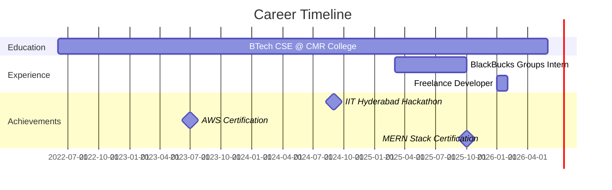

<div align="center">

# 👨‍💻 Abdul Harish Khan

### Full-Stack Developer | MERN Stack Specialist

[](https://git.io/typing-svg)

<p align="center">
  <a href="https://linkedin.com/in/abdul-harish-khan"></a>
  <a href="mailto:khan.abdulhaarish@gmail.com"></a>
  <a href="https://github.com/haarish73"></a>
  <a href="https://www.codechef.com/users/harishkhan9"></a>
</p>


</div>

---

## 🚀 About Me

```javascript
const abdulHarish = {
    location: "Hyderabad, India",
    education: "BTech CSE @ CMR Engineering College",
    graduationYear: 2026,
    cgpa: 8.26,
    currentRole: "Freelance Full-Stack Developer",
    previousRole: "Software Developer Intern @ BlackBucks Groups",
    
    expertise: {
        frontend: ["React.js", "TypeScript", "Tailwind CSS", "Bootstrap"],
        backend: ["Node.js", "Express.js", "RESTful APIs", "Socket.io"],
        databases: ["MongoDB", "MySQL", "PostgreSQL"],
        cloud: ["AWS", "Netlify", "Docker"],
        testing: ["Jest", "Unit Testing", "Integration Testing"]
    },
    
    achievements: [
        "Built apps serving 500+ concurrent users",
        "Reduced API response time by 30%",
        "IIT Hyderabad Hackathon Finalist (Top 17/200+)",
        "85% code coverage with automated testing"
    ],
    
    currentlyLearning: ["System Design", "Microservices", "Cloud Architecture"],
    funFact: "I can optimize your database queries faster than you can say MongoDB! 🚀"
};
```

---

## 📊 GitHub Analytics

<div align="center">
  


</div>

<div align="center">
  


</div>

---

## 🏆 GitHub Trophies

<div align="center">


</div>

---

## 💻 Tech Stack

<div align="center">

### Languages


### Frontend Development


### Backend Development


### Databases


### Tools & Platforms


</div>

---

## 📈 Contribution Graph

<div align="center">


</div>

---

## 🎯 Featured Projects

<div align="center">

<table>
<tr>
<td width="50%">

### 🏦 Zerodha Clone - Trading Platform
[](https://github.com/haarish73)

**Tech Stack:** React.js • Node.js • MongoDB • Chart.js

- 25+ modular React components
- Real-time financial charts with 5-sec updates
- JWT authentication with Passport.js
- 45% faster queries via MongoDB optimization

</td>
<td width="50%">

### 📚 Project Enrollment System
[](https://github.com/haarish73)

**Tech Stack:** React.js • Node.js • MongoDB • Socket.io

- Real-time WebSocket notifications
- Supports 200+ active users
- Automated batch allocation workflows
- 60% reduction in manual refresh actions

</td>
</tr>

<tr>
<td width="50%">

### 🏨 BookMyStay - Hotel Booking
[](https://github.com/haarish73)

**Tech Stack:** Node.js • Express.js • MongoDB • EJS

- Full CRUD for 5 entities
- 98% email delivery rate (Nodemailer)
- Modular Express Router architecture
- Booking confirmations & cancellations

</td>
<td width="50%">

### 🎓 Madrasa Management System
[](https://github.com/haarish73)
[](https://github.com/haarish73)

**Tech Stack:** React.js • TypeScript • Bootstrap

- 15+ TypeScript React components
- Mobile-first responsive design
- React Hooks state management
- Supports 5+ screen sizes

</td>
</tr>
</table>

</div>

---

## 💼 Professional Journey



### 👨‍💻 Experience Highlights

**Software Developer Intern** @ **BlackBucks Groups** | *Mar 2025 - Oct 2025*
- ⚡ Engineered 2 production apps serving **500+ concurrent users** with **99.5% uptime**
- 🚀 Reduced API response time by **30%** (800ms → 560ms)
- 🔐 Built role-based access control with JWT for 3 user roles
- ✅ Achieved **85% code coverage** with 50+ Jest unit tests
- 📉 Reduced production defects by **35%**

**Freelance Full-Stack Developer** @ **Social Crafts Circle** | *Jan 2026 - Present*
- 🎨 Delivered custom platform with 3D animations in **1 week**
- 📱 Optimized performance to maintain **60fps** on mobile
- 🌐 Deployed on Netlify with SSL & custom domain
- ⭐ Maintained **100% client satisfaction**

---

## 🏅 Certifications & Achievements

<div align="center">

| Certification | Issuer | Year |
|--------------|--------|------|
| 🎓 Full Stack Web Development - MERN Stack | Apna College | 2025 |
| ☁️ AWS Academy Cloud Foundations | AWS | 2023 |
| ☁️ AWS Academy Cloud Architecting | AWS | 2023 |
| 🎨 Foundations of User Experience Design | Google (Coursera) | - |
| 💻 Data Structures & Algorithms with Java | Smart Interviews | - |

### 🏆 Achievements
- 🥈 **Finalist** - BOSCH x Tinkerers' Lab Hackathon, IIT Hyderabad (Top 17 of 200+ teams)
- 💻 **CodeChef Profile:** [harishkhan9](https://www.codechef.com/users/harishkhan9)

</div>

---

## 📫 Let's Connect!

<div align="center">

[](https://linkedin.com/in/abdul-harish-khan)
[](mailto:khan.abdulhaarish@gmail.com)
[](https://github.com/haarish73)
[](https://www.codechef.com/users/harishkhan9)

### 💡 Open for opportunities in Full-Stack Development roles!

**📍 Location:** Hyderabad, India  
**🎓 Graduating:** June 2026  
**💼 Available for:** Full-time roles, Internships, Freelance projects

</div>

---

<div align="center">

### 🌟 "Code is like humor. When you have to explain it, it's bad." – Cory House


**⭐️ From [haarish73](https://github.com/haarish73) - Happy Coding! 🚀**

</div>
